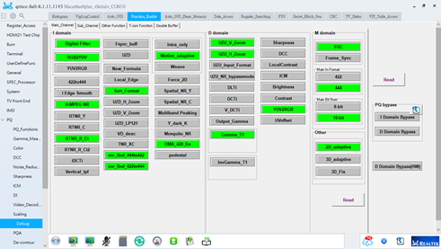

------

# 第一章 Gamma相关

## 1.1 gamma tool

目前发现下面的现象：

1. SDK1下：CA210与Tool连接正常。

   如果不拔掉，切换SDK2，仍能够连接正常；（×）

   如果拔掉，切换SDK2，连接不上；                （√）

2. SDK2下：CA210与Tool连接不上。

   如果不拔掉，就切换SDK1，仍旧连接不上。（×）

   如果拔掉，再切SDK1，就可以连接上。        （√） 

也就是说，**只有断掉PC与CA的连接再切换SDK，切换的信息才能更新**。这也是咱们以前没有发现问题的原因，建议对于安装了两个SDK的电脑，**每次切换SDK前，首先断连接和关Tool**。

## 1.2 Gamma算法 

### 1．CA410没有直接输出RGB而输出XYZ，Tool是怎样计算出RGB的，有误差吗？

### 2. Octave拟合方法：

（来自http://blog.sciencenet.cn/blog-1251937-1145568.html）

matlab中有多种方式进行非线性拟合：nlinfit，cftool等，因为**octave中只有nlinfit**，所以基于兼容性的考虑，我们只采用nlinfit函授，该函数用法如下：

`beta = nlinfit(X,Y,modelfun,beta0)`

`beta = nlinfit(X,Y,modelfun,beta0,options)`

`beta = nlinfit(___,Name,Value)`

`[beta,R,J,CovB,MSE,ErrorModelInfo] = nlinfit(___)`

## 1.3 FYI

\1. 投影屏幕的新方法: 如果IC已经烧录img，可以读入图片，则可以通过读图来盖掉OSD，进而实现打Pattern。（from [**elitsai**](mailto:elitsai@realtek.com)）

\2. 如何减少其他IP对Gamma Measure精度的影响?可在Debug页面关掉能关掉的IP，具体关掉的页面如下图所示（from [**sharlene**](mailto:sharlene.chang@realtek.com)）：

