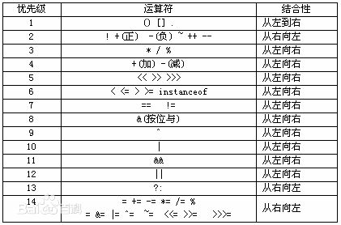

# 第三章 C++相关/QT相关

## Day1

\1. 全局变量：生命周期跨越整个程序运行期间，优先于Main函数进行初始化，在main函数返回后撤销即析构。

\2. CSingleClock：

1. 主要用于同步多个线程对于同一个数据类型的即时访问；

2. 在创建CSingleClock对象时会自动根据参数赋值，而且会lock，不用显式lockà即只需要创建对象即可lock；

3. CSingleClock对象需要有一个从CSyncObject对象；

\3.符号的优先级：数学运算符优先于关系运算符

\4.纯虚函数：C++通过支持纯虚函数来支持创建抽象数据类型，纯虚函数必须在派生类中进行重写，任何包含有一个或多个纯虚函数的类都是抽象类。抽象类智能作为基类而不能实例化。

 \5.参数化列表与构造函数的关系：AB a(5) ,b(3),c[3],*p[2] = {&a,&b};

 		a(5)，一个对象调用一次构造函数；

​		 c[3], 数组调用3次构造函数；

 		指针，没有指向新的空间，更没有分配内存，不会调用构造。

\6. *(p++) += 100; 等价于 *p += 100; p++;

​		P++是运行完代码后再运行的。

 \7.  int b[3][5]; /*这里b指向一个数组的指针*/

1. 数组指针：指向多个元素的指针。int (*p)[5] = b; 

2. 指针数组：一个存放制定类型指针的数组。 Iint *p[3] = {b[0],b[1]};

  \8. 以#开头的语句都是预处理阶段处理的

​		{#include头文件; #define 宏定义; #ifdef #endif条件编译;}

  \9. 面向对象语言特点：抽象，封装，继承，多态。

## Day 2

\1.   原码，反码和补码的概念：https://www.cnblogs.com/zhangziqiu/archive/2011/03/30/ComputerCode.html；

\2.   Int x = 1;int y = ~x; y是-2，因为计算机按照补码运算；

\3.   Scanf的字符不会输出到屏幕上，除了使用空白字符作为分隔符还可以使用其他分隔符；

## Day 3

类型强转（type cast）

**①  static_cast<目标类型> (标识符)**

{在一个方向上可以作隐式转换，在另外一个方向上就可以作静态转换。}

**② reinterpret_cast<目标类型> (标识符)**

{将数据以二进制存在形式的重新解释}

einterpret_cast 最famous的特性就是什么都可以，转换任意的类型，包括C++所有通用类型，所以也最不安全

~~~C++
int x = 0x12345648;
char *p = reinterpret_cast<char*>(&x);
//char*p = static_cast<char*>(&x);
printf("%x\n",*p);
int a[5] = {1,2,3,4,5};
int *q = reinterpret_cast<int*>((reinterpret_cast<int>(a) +1));
printf("%x\n",*q); /*%x 对应输出小写字母十六进制数*/
return 0;
~~~

应用：1. 整形和指针之间的相互转化

2. 指针和引用转化为任意类型的指针和引用

C++中**const** 定义的变量称为常变量。变量的形式，常量的作用，用作常量，**常用于取代#define 宏常量**。

**③ dynamic_cast<目标类型> (标识符)**

用于多态中的父子类之间的强制转化

**④ (脱)常类型转换：const_cast<目标类型> (标识符) //目标类类型只能是指针或引用。**

用来移除对象的常量性(cast away the constness)，使用const_cast 去除const 限定的通常是为了**函数能够接受这个实际参数**。

## Day 4

**1.** 动多态，**不是在编译器阶段决定，而是在运行阶段决定，故称为动多态。动多态行成的

条件如下:

1. 父类中有虚函数。

2. 子类override(覆写)父类中的虚函数。

3. 通过己被子类对象赋值的父类指针或引用，调用共用接口。

**2.** 纯虚函数 virtual** **函数声明= 0;**

​    含有纯虚函数的类，称为抽象基类，不可实列化。即不能创建对象，存在的意义就是被继承，提供族类的公共接口，java 中称为interface。

3.*pa = new Cat;这里指针赋值犯了错误，应该为pa = new Cat;

## Day 5

