# Notes

## 零.    待处理任务（至2019.01.10）

**1.Endo  --> 逗号错误  -->算法尝试**

​               **-->HUAWEI智慧屏的蓝光会被过滤掉的功能集成在Gamma下面，问问市场那边有没有考虑过？**

**2.VideoPath所经过的模块检查**

**3. Mac7P的Tool问题**

**4.Tool的setMessage的机制；**

**5.BCB一些弹窗的不同分辨率下窗口需要缩放的问题**

**6. Merlin6 Prepare**

**7. Mac 6P 7P Output Gamma曲线调整方式需要改进**

**8.atestGamma添加Charts**

## 一. 处理问题进展

### 处理问题进展表


 

### Log备忘录

1.RT电脑IP： 172.22.38.139

用户名：      RTDOMAIN\PUBUSER_MM04

密码：       RTKVIPwinner99

 

2.日期：2019/12/20 

试图注释掉Merlin5 Gamma Measure中的meaPara.myCa210部分；

修改Get Date；

修改Connect后0Cal；

3.下载Skype For Business ： https://products.office.com/en/skype-for-business/download-app#desktopAppDownloadregion

 

## 二. 笔记（经验整理）

### 1 Gamma相关

#### 1.1  Gamma Tool 

目前发现下面的现象：

1. SDK1下：CA210与Tool连接正常。

   如果不拔掉，切换SDK2，仍能够连接正常；（×）

   如果拔掉，切换SDK2，连接不上；                （√）

2. SDK2下：CA210与Tool连接不上。

   如果不拔掉，就切换SDK1，仍旧连接不上。（×）

   如果拔掉，再切SDK1，就可以连接上。        （√） 

也就是说，**只有断掉PC与CA的连接再切换SDK，切换的信息才能更新**。这也是咱们以前没有发现问题的原因，建议对于安装了两个SDK的电脑，**每次切换SDK前，首先断连接和关Tool**。

#### 1.2 Gamma算法

1. CA410没有直接输出RGB而输出XYZ，Tool是怎样计算出RGB的，有误差吗

2.  Octave拟合方法：

（来自http://blog.sciencenet.cn/blog-1251937-1145568.html）

matlab中有多种方式进行非线性拟合：nlinfit，cftool等，因为octave中只有nlinfit，所以基于兼容性的考虑，我们只采用nlinfit函授，该函数用法如下：

~~~mathematica
beta = nlinfit(X,Y,modelfun,beta0)
beta = nlinfit(X,Y,modelfun,beta0,options)
beta = nlinfit(___,Name,Value)
[beta,R,J,CovB,MSE,ErrorModelInfo] = nlinfit(___)
~~~

3. 为何校正失败的时候会出现怪怪的图像，怎样才能在失败的时候回复图像到原始状态？

   

#### 1.3 FYI

\1. 投影屏幕的新方法: 如果IC已经烧录img，可以读入图片，则可以通过读图来盖掉OSD，进而实现打Pattern。（from [**elitsai**](mailto:elitsai@realtek.com)）

\2. 如何减少其他IP对Gamma Measure精度的影响?可在Debug页面关掉能关掉的IP，具体关掉的页面如下图所示（from [**sharlene**](mailto:sharlene.chang@realtek.com)）：

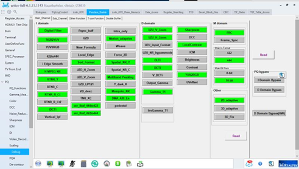

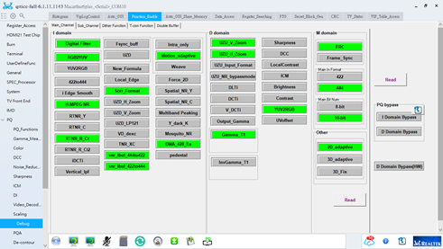


### 2 Tool-PC相关

#### 2.1 CnPack技巧

1.Shift+F2启用或停用；

2.Ctrl+Shift+V局部变量编辑区域；

3.专家包的source目录里有cnDebug.pas文件，这是一个供运行期间输出调试的接口单元，使用cnDebugViwer查看；

4.代码的自动完成功能：把安装的source目录PSDedEx目录放到 搜索路径中；

#### 2.2 Gamma Measure logFile路径设置 ：

~~~C++
logFilePath = sysconfig.get_path(KEY_PATH_ROOT).c_str();
logFilePath += static_cast<AnsiString>("res/log/logFile.txt");
if(logFile != NULL)
  logFile.close();
logFile.open(logFilePath.c_str(),ios::app);
'logFile.clear();
~~~

#### 2.3 Tool Global

\1.platform.db蕴含了注册IC的信息——比如说当新增IC的时候，光更新源代码是无法在Tool里增加这个页面的信息的；

\2.当使用BCB的时候Can’t Create CBuilder6.0/Bin/InitCC32.exe的时候，使用右击管理员模式可以打开；

\3.有时候为了获得rBus的信息，用寄存器的虚拟名字搜索不到时，可以考虑搜rBus内部的信息；

也可以使用notepad ++的在文件中搜索的功能，速度会很快。

\4.添加.cpp文件时，除了要包对应的头文件，不要忘记使用Add To Project，同理可添加.lib文件等；

\5. .h文件不可包太多头文件；

 FYI：在整理Global文件中必须的文件时，比较简便的方法是让编辑器告诉你哪些文件缺失，这样整理起来会快一点。

\6. 使Tab不可见：TabSheet1->TabVisible = false;

\7. 使用SecureCRT记得要断掉之后，才能在Tool里进行读写操作。

\8.  测试使用的Tool，可以用platform.db release比较轻便的Tool发给测试人员。

\9. 如果想要最小的测试版的Tool，则使用standalone版本。

\10.查看Tool的Owner直接查看code的log，看看最近上传的人。

\11.在BCB中查看自己的工程文件的目录，可以通过点击**View Unit按钮（Ctrl+F12)**。

#### 2.4 在VideoPath中添加PTG步骤

因为BCB版本的VideoPath是用xml写UI部分的，所以修改分为两大部分：

1. D:\QRtice\res\modules\home\VideoPath\merlin5\VideoPath.xml

( 这里修改的是添加的部件的基本属性：

~~~xml
<item class="ptg" caption="memc_mute_ctrl" mode="img/patterns/MEMC/Blue_Screen"/> 
~~~

2. 对应上一步中的路径中的list 文件，描述了部件的选择属性。

3. 修改D:\QRtice\src\modules\independ\VideoPath\block\CIPBlock(IC名称).cpp中的实际操作部分——比如读写寄存器；

PS：最新的VideoPath Q中已经可以直接添加。

#### 2.5 在QT中实现读写和加载图片：

##### 2.5.1 读写

~~~C++
#include "CMainController.h"
RT_pIo(CMainController);
RT_pc(CMainController);

    bool ferr = false;
    uint regVal = 0, sceneVal = 0;
    pIo->_StopByMode();
    try{
       ferr = pIo->_BurstReadWord(0xb802ca00,&regVal);
    }catch(...){
       pc->setMessage("Connect Fail",'x');
    }
    if(!ferr)
        pc->setMessage("Read Fail,Check Connect",'x');
sceneVal = (regVal) & 0x08000000; /*这里使用按位与来实现特定位读*/

regVal = regVal ^ 0x08000000;
pIo->_BurstWriteWord(0xb802ca00,&regVal); /*这里使用异或来实现特定位写*/

~~~

##### 2.5.2 加载图片

~~~C++
QImage *img=new QImage;
/*图片路径可在qrc文件夹里通过右击选择图片路径*/
img->load(":/Spbtn_VIP_Terminal_Close.png");
/*这里通过QImage来实现label加载图片*/
ui->lblScene->setPixmap(QPixmap::fromImage(*img));

~~~

#### 2.6 003: Write Error

当StopByMode(true) 与 RunByMode()重叠使用时，会报错误。一定要确保二者夹住的区域不能让再出现它们。

#### 2.7 CA 410引起的支线程的混乱问题

1.首先C++ Builder可以标注线程的数目；

2.帮助查看Timer是否会开启支线程？

#### 2.8 ScrollBar的滑块闪烁的问题

在窗体上放一个edit然后在ScrollBar的OnScroll事件中让edit获得焦点。

~~~C++
void __fastcall TForm1::ScrollBar1Scroll(TObject *Sender,
   TScrollCode ScrollCode, int &ScrollPos)
{
    **Edit1->SetFocus();**
}
~~~

使用OnChange函数之后，往往会使得焦点失去，通过**SetFocus()**函数重新获得焦点。

#### 2.9 打开文件常见的防呆语句

~~~C++
if(dlgOpen3->Execute()){                   
    file_path = dlgOpen3->FileName.c_str();
    mmo3->Clear();
    mmo3->Lines->LoadFromFile(file_path);
}else{
    return;				/*预防打开后没有选中就关闭*/
}
~~~

#### 2.10 PC系统

1. 打开我的电脑页面：工具-->映射磁盘驱动器-->复制粘贴欲映射的路径；

2. 

### 3 C++相关

#### Day 1

\1. 全局变量：生命周期跨越整个程序运行期间，优先于Main函数进行初始化，在main函数返回后撤销即析构。

\2. CSingleClock：

{1.主要用于同步多个线程对于同一个数据类型的即时访问；

2.在创建CSingleClock对象时会自动根据参数赋值，而且会lock，不用显式lockà即只需要创建对象即可lock；

\3. CSingleClock对象需要有一个从CSyncObject对象；

} 

3.符号的优先级：数学运算符优先于关系运算符

 

4.纯虚函数：C++通过支持纯虚函数来支持创建抽象数据类型，纯虚函数必须在派生类中进行重写，任何包含有一个或多个纯虚函数的类都是抽象类。抽象类智能作为基类而不能实例化。

 

5.参数化列表与构造函数的关系：AB a(5) ,b(3),c[3],*p[2] = {&a,&b};

 a(5)，一个对象调用一次构造函数；

 c[3], 数组调用3次构造函数；

 指针，没有指向新的空间，更没有分配内存，不会调用构造。

\6. *(p++) += 100; 等价于 *p += 100; p++;

P++是运行完代码后再运行的。

 \7.  int b[3][5]; /*这里b指向一个数组的指针*/

（1）数组指针：指向多个元素的指针。int (*p)[5] = b; 

   （2）指针数组：一个存放制定类型指针的数组。 Iint *p[3] = {b[0],b[1]};

  \8. 以#开头的语句都是预处理阶段处理的

{#include头文件; #define 宏定义; #ifdef #endif条件编译;}

  \9. 面向对象语言特点：抽象，封装，继承，多态。

#### Day 2

\1.   原码，反码和补码的概念：https://www.cnblogs.com/zhangziqiu/archive/2011/03/30/ComputerCode.html；

\2.   Int x = 1;int y = ~x; y是-2，因为计算机按照补码运算；

\3.   Scanf的字符不会输出到屏幕上，除了使用空白字符作为分隔符还可以使用其他分隔符；

#### Day 3

类型强转（type cast）

①  static_cast<目标类型> (标识符)

{在一个方向上可以作隐式转换，在另外一个方向上就可以作静态转换。}

② reinterpret_cast<目标类型> (标识符)

{将数据以二进制存在形式的重新解释}

einterpret_cast 最famous的特性就是什么都可以，转换任意的类型，包括C++所有通用类型，所以也最不安全

~~~C++
int x = 0x12345648;
char *p = reinterpret_cast<char*>(&x);
//char*p = static_cast<char*>(&x);
printf("%x\n",*p);
int a[5] = {1,2,3,4,5};
int *q = reinterpret_cast<int*>((reinterpret_cast<int>(a) +1));
printf("%x\n",*q);
return 0;
%x 对应输出小写字母十六进制数
~~~

应用：1. 整形和指针之间的相互转化

2. 指针和引用转化为任意类型的指针和引用

C++中**const** 定义的变量称为常变量。变量的形式，常量的作用，用作常量，**常用于取代#define 宏常量**。

③ dynamic_cast<目标类型> (标识符)

用于多态中的父子类之间的强制转化

④ (脱)常类型转换：const_cast<目标类型> (标识符) //目标类类型只能是指针或引用。

用来移除对象的常量性(cast away the constness)，使用const_cast 去除const 限定的通常是为了**函数能够接受这个实际参数**。

#### Day 4

**1. 动多态，不是在编译器阶段决定，而是在运行阶段决定，故称为动多态。动多态行成的条件如下:**

1. 父类中有虚函数。

2. 子类override(覆写)父类中的虚函数。

3. 通过己被子类对象赋值的父类指针或引用，调用共用接口。

**2. 纯虚函数 virtual*函数声明= 0;**

含有纯虚函数的类，称为抽象基类，不可实列化。即不能创建对象，存在的意义就是被继承，提供族类的公共接口，java 中称为interface。

**3. pa = new Cat;这里指针赋值犯了错误，应该为pa = new Cat;**

#### Day 5 

<span style = 'background:red;'>**友元**</span>

类的数据成员一般定义为私有成员，成员函数一般定义为公有的，依此提供类与外界间的**通信接口**。

有时需要定义一些函数，**这些函数不是类的一部分**，**但又需要频繁地访问类的数据成员**，这时可以将这些函数定义为该类的友元函数。友元可以是一个函数，该函数被称为**友元函数**；友元也可以是一个类，该类被称为**友元类**。

友元函数是可以直接访问类的私有成员的非成员函数。它是定义在类外的普通函数，它不属于任何类，但需要在类的定义中加以声明，声明时只需在友元的名称前加上关键字
friend，其格式如下：
**<span style = 'color:red;'>friend 类型函数名(形式参数); </span>**或者

<span style = 'color:red;'>**friend class 类名;    其中：friend 和class 是关键字，类名必须是程序中的一个已定义过的类。**</span>

<span style = 'background:red;'>**继承与派生**</span>

```C++
class 派生类名：[继承方式] 基类名
{
派生类成员声明；
};                /* is -a 关系*/
```

一个派生类可以同时有多个基类，这种情况称为多重继承，派生类只有一个基类，称为单继承。

**公有继承**：基类的公有成员和保护成员在派生类中保持原有访问属性，其私有成员仍为基类的私有成员。
**私有继承**：基类的公有成员和保护成员在派生类中成了私有成员，其私有成员仍为基类的私有成员。
**保护继承**：基类的公有成员和保护成员在派生类中成了保护成员，其私有成员仍为基类的私有成员。

### 4 硬件相关

\1.   Patten Gen的功能是打出需要的背光，即特定格式的画面。比如液晶的发光特性可能会导致一些特殊的画面（比如周期性栅线画面）异常，通过打出对应的画面可以针对性地解决这些问题。

\2.   install_user_RTD28XOB8_A1_129：红色部分标识的就是BootCode信号；

烧录的过程中，如果按Tab键进入不了bootcode, 往往需要重新烧rescue.bin；

#### 4.1 验证Video path 的步骤和方法：

测试主要分为三个Path：Main，Sub和DMA（在实际成像过程中要注意OSD）

PTG：接Source后，直接点击；

CRC：接Source后，直接点击（切成静止画面后，观察是否变化），因为CRC是当前每帧图像算出的校验码，因此画面静止后理论算出的CRC应该保持不变；

TM：Time Measure，各参数含义。

| **Input** | **Description**    |
| --------- | ------------------ |
| clk       | Clock              |
| den_in    | Data enable        |
| rst_n     | ”low” active reset |
| y_in      | Pixel input        |
| u_in      | Pixel input        |
| v_in      | pixel input        |
| hs_in     | H-sync input       |
| vs_in     | V-sync input       |


| **output** | **Description** |
| ---------- | --------------- |
| den_out    | Data enable     |
| r/y_ out   | Pixel out put   |
| g/u_ out   | Pixel out put   |
| b/v_ out   | pixel out put   |
| vs_ out    | V-sync output   |
| hs_ out    | H-sync output   |

DataAccess：接Source后，直接点击（查看selective curve…中模块是否为自己选的及读取功能）

### 5 系统课程

#### 5.1 3D_LUT课程

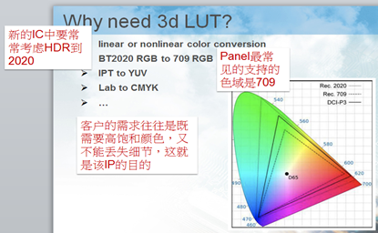

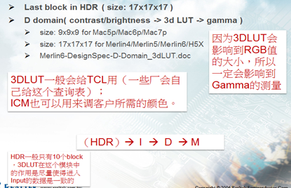

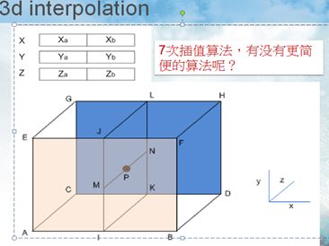

Index programmable的作用：是使得插值点可在区间内任意移动。

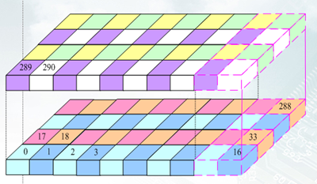

 

#### 5.2 ColorSpace_Conversion课程

1. 

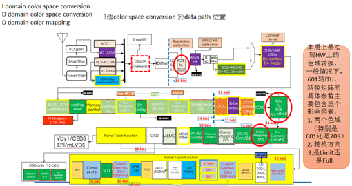

2. 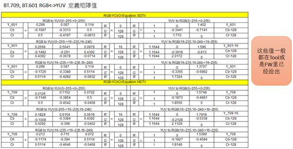

3. 计算过程整理：

   步骤有三，值得注意的有两个方面：

   **①** 要根据limit_scale****计算出full to limit**

   比如yuvfull_to_yuvlimit = 

   limit_scale       0          0

   0        limit_scale_UV  0

   0        0            limit_scale_UV

   **②** 接下来，是选取矩阵，这里是rgb2yuv_709 * bt2020_2_bt709

   **③** 逐次相乘后，将最终的计算结果，**靠着2补位存储**：

   負數轉正數用2’s complement

   register(16 進位) = 

     0x0399  0x094A  0x00D0

     0x7DE1  0x7A1F  0x0800

     0x0C70  0x74BC  0x7ED3

4. 从一个RGB色域转到另一个RGB色域的计算过程：

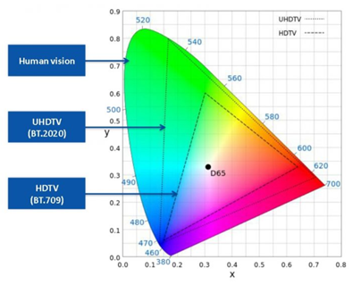


​				Step1 : 輸入 A 的小xyz 座標, 算出 RGB->XYZ 的轉換矩陣Ma

​				Step2 : 輸入 B 的小xyz 座標, 算出 XYZ ->RGB 的轉換矩陣Mb

​				Step3 : 算M1 

​     				M1 = Mb*Ma

​				Step4: 算M2

​				將 M1轉為S(14,11) 填進HW

​				Step5 :將 M2矩陣 調整為row sum=2048 得到M3

​				公式 : 

​				M3(1,X) = M2(1,X) * (    1/(M2(1,1)+M2(1,2)+M2(1,3))    );

​				M3(2,X) = M2(2,X) * (    1/(M2(2,1)+M2(2,2)+M2(2,3))    );

​				M3(3,X) = M2(3,X) * (    1/(M2(3,1)+M2(3,2)+M2(3,3))    );

​			（这里是为了使得最终得到的值相加等于一）

​				**色域转换的关键是以XYZ作为桥梁，而其中向XYZ**的转换矩阵计算如下图：** 

5. Tool中有工具帮忙计算矩阵值：

   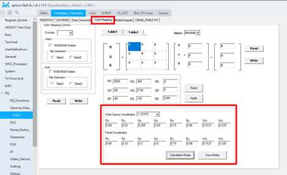

   如需要进步了解，资料存储在：D:\1Learning\13 RTColorSpace

#### 5.3 Dither课程

Dither的主要作用是弹bit。

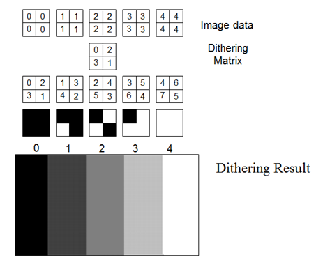

感觉还是很神奇的，在bit数减少后，还能保持以前的显示效果。最后一张图放大看，还是能看到颗粒状的。这种颗粒的效果，恰恰是IC最需要解决的，把随机引入图片中，从而最大限度的使原本的色块显示均匀。

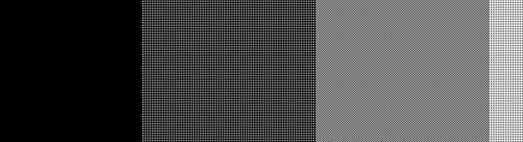

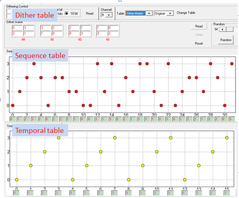

#### 5.4 Decontour课程

1. Contours：轮廓线。亮度差很小的轮廓边，往往是对Source的压缩导致的。从图上可以明显地看到轮廓边。

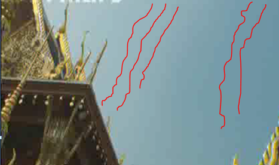

一．传统的Decontour方法

2. 使用Spatial Detection （空间侦测）

   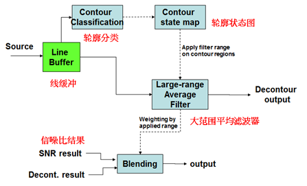

在相邻的5*5区域内计算与周边值的差值；将点所在的区分为三类，平坦区、云图区、纹理区；

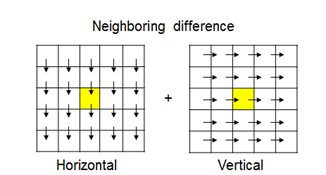


\1. **Neighboring contrast level****局部对比水平**

按照与周围点的差的和进行分类，根据三个对比度阈值将轮廓水平分为四个区间；阈值编号越大，表明轮廓水平值越大；

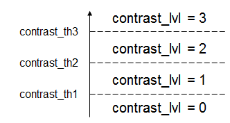

2.**Gradation level** **梯度水平**

根据一阶差值和二阶差值相对两个阈值的位置，将点所在区域的梯度水平分为四个level；

**3.**   **Max-min level****最高最低水平**

Max value - min value inside 5x5 mask相邻的5*5区域内的最大值和最小值

让一个区域内的最大最小水平成为可调的

对于电影上的低对比度图案等，我们可能希望在低Max-min level最高最低水平应用更高的级别，以防止模糊 

**4.**   **Final Contour Level** **最终的云图水平**

轮廓水平：最大（**局部对比水平，****Gradation level** **梯度水平，Max-min level****最高最低水平**）

Final contour classification:分为五个水平；即平坦（非云图），小、中、大云图，纹理（非云图）； 

**5.**   **Linear Filter**

展开筛选器，直到：

纹理可见

达到最大过滤范围

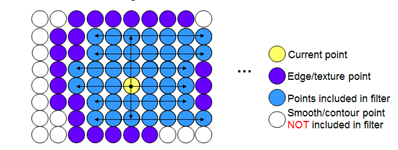 

**6.**   **瓶颈过滤器限制**

使用瓶颈宽度限制水平距离，用于**纹理区域周围轮廓区域的连续性**。

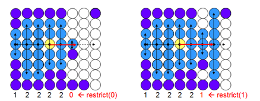

**7.**   **逐级筛选范围**

在不同的轮廓级别上应用不同的过滤范围，低层轮廓上较小的滤波范围。 

同时限制相邻点上的滤波器范围以保持连续性，如果平均过滤范围包括轮廓水平较低的点，则拟合较低的范围

Debug Mode：将云图水平在图片中用不同颜色显示出来；

– FLAT: black

– CONT_HI: red

– CONT_MD: magenta (Merlin5, Mac7p)

– CONT_LO: blue (Merlin5, Mac7p)

– EDGE_TEX: green 

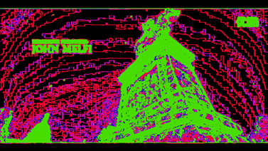

Debug mode 1: show filter size

Debug mode 2: Show max-min level

**二．Block Decontour (H5X, Merlin5)** **块为单位进行云图消除**

计算块内的平均值，将平均值最为块中每个像素点的取值，将这个结果作为平滑的结果；与LC(Local Contrast)的差别在于要用到三个通道的值；

将SRC与上面结果进行加权平均；权重值依据他们之间的差值而定，差值越小，平滑结果占得权重越大；

由图可知，输入数据和统计得到的平均数据做加权平均可得到输出结果，即黄色底框标识出来的部分；在做加权平均之前，要保证两组数据的精度一致，要对数据的值做位数转换，转化的方法使用线性差值；

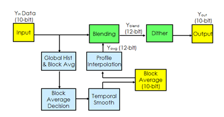


将abs（Yin-Yavg）映射到混合权重

使用混合权重混合Yin和Yavg

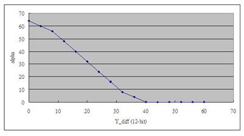

#### 5.5 Gamma课程

整个Gamma校正的主要流程都在这三张图里：

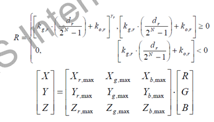

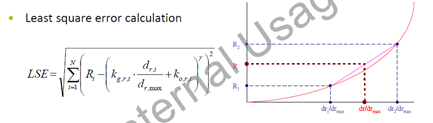

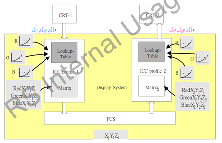

 

目前已经根据图二的公式引入梯度下降方法，相比于以前直接计算误差的方法可以更快地收敛到极值，（大概在10次以内找到正确值）：

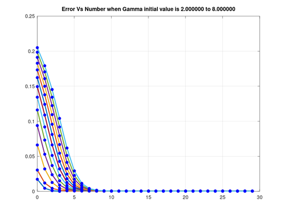

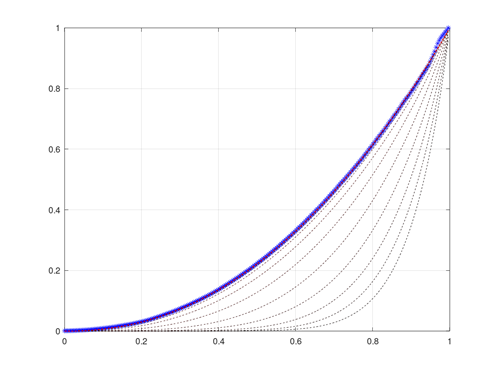

  

具体算法需要进一步挖掘。

#### 5.6 深入理解操作系统

 

### 6 Git/SQL/GitBook

#### 6.1 gitbook的问题

1. 编辑完summary.md后，使用**gitbook init**.

2. 使用**gitbook pdf  ./ ./1.pdf**，生成pdf文件。

3. typora中设置字体颜色：

   ~~~html
   <span style='color:字体颜色;background:背景颜色;font-size:文字大小;font-family:字体;'>文字</span>
   ~~~

   | COLOR   | result                                   |
   | :------ | :--------------------------------------- |
   | maroon  | <span style='color:maroon;'>文字</span>  |
   | fuchsia | <span style='color:fuchsia;'>文字</span> |
   | red     | <span style='color:red;'>文字</span>     |
   | brown   | <span style='color:brown;'>文字</span>   |
   | blue    | <span style='color:blue;'>文字</span>    |
   | aqua    | <span style='color:aqua;'>文字</span>    |

   

### 7 python/图像处理