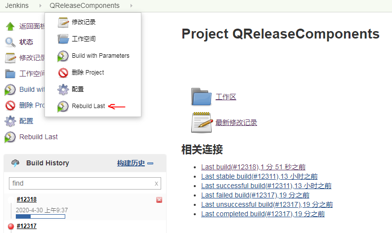

# Notes

<span style='color:red;'>如果一件事决定去做，请一定尽快做完</span>

<span style='color:red;'>写得足够快，才有机会犯错</span>

## 零.    待处理任务（至2020.12.11）

- [ ] **1.Endo  --> 逗号错误  -->算法尝试**

​               **-->HUAWEI智慧屏的蓝光会被过滤掉的功能集成在Gamma下面，问问市场那边有没有考虑过？**

- [ ] **2. VideoPath所经过的模块检查**

- [ ] **3.  Mac7P的Tool问题**

- [ ] **4. Tool的setMessage的机制；**

- [ ] **5. BCB一些弹窗的不同分辨率下窗口需要缩放的问题**

- [ ] **6. Mac 6P 7P Output Gamma曲线调整方式需要改进**

- [ ] **10.矩阵类的书写；（格式参考）**

  

  ### **本周任务**

  ---

- [x] **7.H5C2 Function Spec**

- [x] **8.Mark2 的Tool问题：Dither,HDMI Debug**

- [x] **9.根据色差公式计算最大允许误差，并且考虑增加Delta E2000页面**

   

- [x] **10.杂项：a.和李强商量下memory的计算;**

  ​                   **b.测试inv_gamma;**

  ​                   **c.测试dither；**

  ​                    

------


## 一. 处理问题进展

### 1.即时问题反馈（2020/12/4）

Q1.ACL3 Path指的是什么？8P转成1P是指什么？

Q2.什么是PinShare Script？

T8.1：处理merlin6上的hdmiDebug问题。

T9.1：验证在标准点上矩阵是否有效？

T9.2：试验3DMatrix；

T9.3：确定最后的插值算法；

T9.4：确定ΔE公式，并显示在UI上。

Gamma Tool Report：采用Jeffery学长的思路测试了下：

​    1.更改了所有点fineTune顺序

​    因为中间的RGB Combination 永远介于两端的RGB Combination值，这相当于引入一个约束。

​    因为插值后的点总是比 R=G=B 的combination接近Target，所以选择插值后的点作为初始点，相当于一个更优的初始点。

​    故修改了点的调整顺序，并且每次调整后，都会重新插值，并将插值后的整体数据作为新的调整点的参考条件。


### 2.日志

1. RT电脑IP： 172.22.38.139

   用户名：      RTDOMAIN\PUBUSER_MM04

   密码：       RTKVIPwinner99

2. 日期：2019/12/20 

   试图注释掉Merlin5 Gamma Measure中的meaPara.myCa210部分；

   修改Get Date；

   修改Connect后0Cal；

3. 下载Skype For Business ： https://products.office.com/en/skype-for-business/download-app#desktopAppDownloadregion

4. 烧录Mac7P的img记得放入Y:\MM2\SD\VIP\Daily(FW)文件夹里。

5. 公网账号：2JMzLhNH

   

6. VDP密码：bGr9h5Pb

7. \\172.22.34.131\g\K7Lp_Spec2LGE是\\Yyy\G\K7Lp_Spec2LGE对应的路径。

8. jenkins YY师兄的账号：

   joey

   vip2379

   rebuild方式：登录后使用rebuild last

   


### 3.工作流程技巧

1. 寻找IP Status的parent页面：因为直接再projects里直接打开JIRA，看不到那个父页面。
   


​    可以直接搜索关键字：text ~ "IPStatus" AND text ~ "DISPI" AND text ~ "Ring Filter"，这里选Ring Filter是因为它比较少改动，不会 有其他多余信息，这样可以再在打开的页面中寻找到父页面。


3. 寻找某个IP下的改版建议：

   

   eva姐已经整理好。


## 二. 笔记（经验整理）

### 1 Gamma相关

#### 1.1  Gamma Tool 

1. 目前发现下面的现象：
   a. SDK1下：CA210与Tool连接正常。

   如果不拔掉，切换SDK2，仍能够连接正常；（×）

   如果拔掉，切换SDK2，连接不上；                （√）

   b. SDK2下：CA210与Tool连接不上。

   如果不拔掉，就切换SDK1，仍旧连接不上。（×）

   如果拔掉，再切SDK1，就可以连接上。        （√） 

也就是说，**只有断掉PC与CA的连接再切换SDK，切换的信息才能更新**。这也是咱们以前没有发现问题的原因，建议对于安装了两个SDK的电脑，**每次切换SDK前，首先断连接和关Tool**。

2. 对于Gamma Tool，经典模式打背景基本步骤(不考虑与界面交互)

    ~~~C++
	getOriBg(false);
	bgEnable(true,false);
	Sleep(100);
	setBG(_RGB_BG_Color[0], _RGB_BG_Color[1], _RGB_BG_Color[2], false);//使panel显示颜色变化
    ~~~
    
    


#### 1.2 Gamma算法

1. CA410没有直接输出RGB而输出XYZ，Tool是怎样计算出RGB的，有误差吗

2.  Octave拟合方法：

（来自http://blog.sciencenet.cn/blog-1251937-1145568.html）

matlab中有多种方式进行非线性拟合：nlinfit，cftool等，因为octave中只有nlinfit，所以基于兼容性的考虑，我们只采用nlinfit函授，该函数用法如下：

~~~mathematica
beta = nlinfit(X,Y,modelfun,beta0)
beta = nlinfit(X,Y,modelfun,beta0,options)
beta = nlinfit(___,Name,Value)
[beta,R,J,CovB,MSE,ErrorModelInfo] = nlinfit(___)
~~~

3. 为何校正失败的时候会出现怪怪的图像，怎样才能在失败的时候回复图像到原始状态？

4. Gamma Bit位对应

   .png)

   ---

   

   

   ）

2. 如何减少其他IP对Gamma Measure精度的影响?可在Debug页面关掉能关掉的IP，具体关掉的页面如下图所示（from [**sharlene**](mailto:sharlene.chang@realtek.com)）：


3. LUT的组成部分大都是：0x g0 d0 d1;

4. 矩阵类的工作记录：

   ```C++
   /*
   class CArray2{
       CArray2(array&a);
       CArray2& operator =(const CArray2&b);
       CArray2& operator =(const array&b);
       array toArray();
       CArray2& operator + (CArray2&b);
   };*/
   ```

   

1.4 CA分析仪：

​    [CA说明书](https://wenku.baidu.com/view/6c1c1977f46527d3240ce0f7.html)


### 2 Tool-PC相关

#### 2.1 CnPack技巧

1. Shift+F2启用或停用；

2. Ctrl+Shift+V局部变量编辑区域；

3. 专家包的source目录里有cnDebug.pas文件，这是一个供运行期间输出调试的接口单元，使用cnDebugViwer查看；

4. 代码的自动完成功能：把安装的source目录PSDedEx目录放到 搜索路径中；

#### 2.2 Gamma Measure logFile路径设置 ：

~~~C++
logFilePath = sysconfig.get_path(KEY_PATH_ROOT).c_str();
logFilePath += static_cast<AnsiString>("res/log/logFile.txt");
if(logFile != NULL)
  logFile.close();
logFile.open(logFilePath.c_str(),ios::app);
logFile.clear();
~~~

#### 2.3 Tool Global

1. platform.db蕴含了注册IC的信息——比如说当新增IC的时候，光更新源代码是无法在Tool里增加这个页面的信息的；

2. 当使用BCB的时候Can’t Create CBuilder6.0/Bin/InitCC32.exe的时候，使用右击管理员模式可以打开；

3. 有时候为了获得rBus的信息，用寄存器的虚拟名字搜索不到时，可以考虑搜rBus内部的信息；

   也可以使用notepad ++的在文件中搜索的功能，速度会很快。

4. 添加.cpp文件时，除了要包对应的头文件，不要忘记使用Add To Project，同理可添加.lib文件等；

5. .h文件不可包太多头文件；

    FYI：在整理Global文件中必须的文件时，比较简便的方法是让编辑器告诉你哪些文件缺失，这样整理起来会快一点。

6. 使Tab不可见：TabSheet1->**TabVisible** = false;

7. 使用SecureCRT记得要断掉之后，才能在Tool里进行读写操作。

8. 测试使用的Tool，可以用platform.db release比较轻便的Tool发给测试人员。

9. 如果想要最小的测试版的Tool，则使用standalone版本。

10. 查看Tool的Owner直接查看code的log，看看最近上传的人。

11. 在BCB中查看自己的工程文件的目录，可以通过点击**View Unit按钮（Ctrl+F12)**。

12. 更改**platform.db**来检查LGE RTICE设置是否正确：

     使用本地Tool release出一版Tool，然后更改platform.db-->sysconfig.qt中的info信息。加上：

     {"customer":{"name":"LGE","is":"1"}并保存即可。

#### 2.4 在VideoPath中添加PTG步骤

因为BCB版本的VideoPath是用xml写UI部分的，所以修改分为两大部分：

1. D:\QRtice\res\modules\home\VideoPath\merlin5\VideoPath.xml

( 这里修改的是添加的部件的基本属性：

~~~xml
<item class="ptg" caption="memc_mute_ctrl" mode="img/patterns/MEMC/Blue_Screen"/> 
~~~

2. 对应上一步中的路径中的list 文件，描述了部件的选择属性。

3. 修改D:\QRtice\src\modules\independ\VideoPath\block\CIPBlock(IC名称).cpp中的实际操作部分——比如读写寄存器；

PS：最新的VideoPath Q中已经可以直接添加。

#### 2.5 在QT中实现读写和加载图片：

##### 2.5.1 读写

~~~C++
#include "CMainController.h"
RT_pIo(CMainController);
RT_pc(CMainController);

    bool ferr = false;
    uint regVal = 0, sceneVal = 0;
    pIo->_StopByMode();
    try{
       ferr = pIo->_BurstReadWord(0xb802ca00,&regVal);
    }catch(...){
       pc->setMessage("Connect Fail",'x');
    }
    if(!ferr)
        pc->setMessage("Read Fail,Check Connect",'x');
sceneVal = (regVal) & 0x08000000; /*这里使用按位与来实现特定位读*/

regVal = regVal ^ 0x08000000;
pIo->_BurstWriteWord(0xb802ca00,&regVal); /*这里使用异或来实现特定位写*/

~~~

##### 2.5.2 加载图片

~~~C++
QImage *img=new QImage;
/*图片路径可在qrc文件夹里通过右击选择图片路径*/
img->load(":/Spbtn_VIP_Terminal_Close.png");
/*这里通过QImage来实现label加载图片*/
ui->lblScene->setPixmap(QPixmap::fromImage(*img));

~~~

#### 2.6 003: Write Error

当StopByMode(true) 与 RunByMode()重叠使用时，会报错误。一定要确保二者夹住的区域不能让再出现它们。

#### 2.7 CA 410引起的支线程的混乱问题

1.首先C++ Builder可以标注线程的数目；

2.帮助查看Timer是否会开启支线程？

#### 2.8 ScrollBar的滑块闪烁的问题

在窗体上放一个edit然后在ScrollBar的OnScroll事件中让edit获得焦点。

~~~C++
void __fastcall TForm1::ScrollBar1Scroll(TObject *Sender,
   TScrollCode ScrollCode, int &ScrollPos)
{
    Edit1->SetFocus();
}
~~~

使用OnChange函数之后，往往会使得焦点失去，通过**SetFocus()**函数重新获得焦点。

OnChange函数与OnScroll函数的区别：OnChange函数是在移动过程中的每一刻都会触发的 ,所以适合和Edit关联使用；

​																		OnScroll函数是移动后停下来的一刻才会触发，适合和读写寄存器共同使用。（如下示例）

~~~C++
void __fastcall TRtkForm_frmMain::scrlbrFstLineCFGScroll(TObject *Sender,
      TScrollCode ScrollCode, int &ScrollPos)
{
    pcid_pcid_ctrl_RBUS   reg_pcid_pcid_ctrl;

    if(ScrollCode == scEndScroll){ /*接受Scroll操作状态的参数*/
        if(podStruct.m_readOnly)
            return;
        StopByMode();
        BurstReadWord(PCID_PCID_CTRL_2_VADDR,&reg_pcid_pcid_ctrl_2.regValue);
        reg_pcid_pcid_ctrl_2.pcid_tab1_r_thd = scrlbr_pcid_tab1_r_thd->Position;
        BurstWriteWord(PCID_PCID_CTRL_2_VADDR,&reg_pcid_pcid_ctrl_2.regValue);
        RunByMode();
    }
}
~~~


#### 2.9 打开文件常见的防呆语句

~~~C++
if(dlgOpen3->Execute()){                   
    file_path = dlgOpen3->FileName.c_str();
    mmo3->Clear();
    mmo3->Lines->LoadFromFile(file_path);
}else{
    return;				/*预防打开后没有选中就关闭*/
}
~~~

#### 2.10 FAQ About PC

1.  打开我的电脑页面：工具-->映射磁盘驱动器-->复制粘贴欲映射的路径；

2. 如何让任意窗口置顶？-->制作脚本的方式，使用AutoHotKey，写入以下文字：

   ~~~
   ^space::
   WinGetActiveTitle,w
   Winset,AlwaysOnTop,Toggle,%w%
   return
   ~~~

   让ahk脚本开机启动：请把文件置于 C:\Users\用户名称\AppData\Roaming\Microsoft\Windows\Start Menu\Programs\Startup路径下。

   （这里使用Ctrl+Space来实现窗口置顶）

3.  批量去掉或替换文本中的换行符：

   

4. Windows是不区分文件名大小写的，而SVN是区分的。-->所以如果涉及修改文件名大小写的操作：
   1. 把文件保存好，放到另一个文件夹,并修改文件夹名；
   2. 删除掉旧的文件夹，commit;
   3. 将修改好后的文件夹放回，Commit；

5. a. win7桌面背景保存位置:C:\Users\用户名\AppData\Roaming\Microsoft\Windows\Themes 可以在这里找到当前桌面背景图片的保存位置。

   b. 系统自带的壁纸在C:\WINDOWS\Web\Wallpaper文件夹下。 这里存储的是系统自带的壁纸,可以根据个人需要将下载的壁纸放入这个文件夹。

6. 

7.  **SDK**＝放着你想要的软件功能的软件包

   **API**＝SDK上唯一的接口

8.  **索引**的意思是将文件整理建立数据库，建立了索引的路径下下次搜索东西非常的快

9.  BCompare启动失败：

   

   解决办法是删除 C:\用户\[用户名]\AppData\Roaming\Scooter Software\Beyond Compare 3

   目录中的所有文件。

10. SVN遇到报错：

    

    在相应的目录中，比如我在更新metasploit的“/opt/metasploit3/msf3/lib/active_support/core_ext”这个目录时就遇到了类似的情况，把.SVN子目录里(注意，“.”目录是个隐藏目录，需要选择“查看”->“显示隐藏文件”菜单项)面log文件删除，就可以了。然后继续做svn cleanup命令。[from /CSDN/ SVN cleanup 失败后的处理](https://blog.csdn.net/josentop/article/details/6897074)

11.Outlook 如何在邮件页面内查找？

​	查找 = F4 ：需要双击一封邮件，弹出独立窗口，然后 F4

12.晶晶的DDR 单独的Tool的存放地址：

​	http://cadinfo.realtek.com/svn/MM/sd-tv-tools/vip_tool/ddrScanTool

13. 打印机安装驱动失败：发现是WIN10禁止SMB1协议，可以在程序和功能-->启用或关闭Windows功能-->勾选 SMB1.0/CIFS…来允许和XP设备进行通信。

14. 删除网络映射的驱动器：
    假如你的网络驱动器分配的盘符是O，命令如下：

    ```
    net use O: ``/delete
    ```

15. [完美解决github访问速度慢](https://zhuanlan.zhihu.com/p/93436925)

    1. 修改本地hosts文件

    ```text
    windows系统的hosts文件的位置如下：C:\Windows\System32\drivers\etc\hosts
    mac/linux系统的hosts文件的位置如下：/etc/hosts
    ```

    2. 增加[http://github.global.ssl.fastly.net](https://link.zhihu.com/?target=http%3A//github.global.ssl.fastly.net)和[http://github.com](https://link.zhihu.com/?target=http%3A//github.com)的映射

    ```text
    获取Github相关网站的ip
    访问https://www.ipaddress.com，拉下来，找到页面中下方的“IP Address Tools – Quick Links”
    分别输入github.global.ssl.fastly.net和github.com，查询ip地址
    下面是我的配置
    140.82.114.4	github.com
    199.232.5.194	github.global.ssl.fastly.net
    
    
    Notes:需要再刷新下DNS：
    使用win+R输入cmd进入控制台，输入指令 ipconfig /flushdns 刷新DNS
    ```

    3.命令提示符中输入ping [github.com](https://link.zhihu.com/?target=http%3A//github.com)

    

#### 2.11 FAQ About Tool

1. QT如何**输出十六进制格式**的数据：

   ```C++
   QString r1 = QString("%1").arg(forceBg["r"].toQString() , 0, 16);
   ```

2. BCB中**安全删除一个组件**的步骤：

   ​	a. 首先搜索出关键字，在cpp文件中删除对应的响应函数,并且使用这个组件的地方；

   ​	b. 在h文件中删除对应的定义；

   ​	c. 在UI中删除组件。

3. BCB中添加PageControl(PageControl和TabSheet的区别)

   

   **改动Page的先后顺序，只要修改PageIndex**即可。

4. ToIntDef(0)是TEdit常用的属性，比ToInt()更安全。

5. BCB中**新建一个继承现有类**的步骤：
   1. File-->New-->Other-->当前DLL名字的Sheet
   2. 选择要继承的类，双击；
   3. 在新建好的类中修改Name属性；

6. QT中QLayOut的安全删除：

   ~~~c++
   QLayoutItem *child;
   while(child=this->ui->centralWidget->layout()->takeAt(0)) {
       delete child;
   }
   ~~~

   这里有一个问题，LayOut增加组价的时候是使用AddWidget，但是删除的时候却删除Item。

   原因：https://blog.csdn.net/xy913741894/article/details/76814985?locationNum=8&fps=1

7. ```c++
   cellText(Row,Col) //顺序
   ```

8. QT 中的Q指针和D指针：

   

9. 加了**Q_OBJECT宏，才能支持信号槽处理**。-->加了之后请记得在Pro里稍作修改，然后rebuild。

10. 任意函数获得CMainController指针：RT_pc(CMainController);

11. CTtlePanel --> CGroupBox,CGroupBox 支持布局。

    /* this->setStyleSheet{

    ​                                       }可用在代码里设置构建的属性；*/

    

    

    今天介绍了CGroupBox中一些属性的设置，重点介绍了subControl，一般情况下，只要是复合式组件，都会存在subControl属性。如果实际情况下，想查出哪些组件有这个属性，使用Assistant查。

    ```css
    QGroupBox{
    border:1px solid #000;
    margin: 20px;
    padding:20px;
    }
    QGroupBox::title{
    padding:12px 10px 6px 10px;
    backGround: #0fa;
    subcontrol-origin: content;
    subcontrol-position: left bottom;
    }
    ```

    

    ~~~CSS
    QGroupBox{
    border:1px solid #909090;
    font-family: Arial,sans-serif;
    background-color:#fff;
    margin-top: 20px;
    padding:20px;
    font-weight:bold;
    font-size:12px;
    }
    QGroupBox::title{
    padding:6px 100000px 6px 10px;
    backGround: #14892c;;
    subcontrol-origin: margin;
    subcontrol-position: top left;
    color:#FFF;
    }
    ~~~

    

    

12. 组件式编程：

13. **outlook使用技巧：** 搜索收件人：from:"xxx",搜索发件人：to:"XXX";F4搜索长邮件；

14. json_decode_file()读取的是.json文件，而且里面只能有一个大的array：

    ~~~C++
        array infos = json_decode_file("D:\\infos.json");
        qDebug()<<"infos="<<json_encode(infos);
    ~~~

15. 工作流程：在另一个电脑上使用AutoTest的时候，可以戴一个耳机，往往可以听到报错的声音，可以及时停止并重新测试。


### 3 C++相关

#### 3.1 Global about QT

1. ```C++
   /*free current view*/
       if(p_wgtView){
           p_lytView->removeWidget(p_wgtView);
           delete p_wgtView;
           p_wgtView = NULL;
       }
   if(p_lytView){	//delete layout
           ui->pnlView->setLayout(NULL);
           delete p_lytView;
           p_lytView = NULL;
       }
   ```

2. ```C++
   if (atvInfo.is_set("Demod")) {
           array &atvTypeInfo = *(atvInfo["Demod"].value.val_array);
           const char *atvTypeName = atvTypeInfo.find_firstKey();
           while (atvTypeName) {
               ui->cbxDemod->addItem(atvTypeName);
               atvTypeName = atvTypeInfo.find_nextKey();
           }
       }
   /*请使用非map方式进行改写*/
   ```

3.  bool型与QString型之间的相互转换

   bool testParam;

   QString tempParam = QString::number(testParam);

   //上面是bool 转QString;

   

   QVariant tempValue = tempParam;

   bool tempFinished = tempValue.toBool();

   //这样就把QString 类型的转换回去了。
   ————————————————
   原文链接：https://blog.csdn.net/li235456789/article/details/50696942

4. CTable属性：AlternatingRowColors让行与行之间颜色不同；

#### 3.2 Global about BCB

1. bcb 中Tstrnggrid cell中塞控件，会有错位闪的问题。 替代方案是，用TScrollBox 去替代TStringGrid 的vertical scallbar。

   \1. 控件（checkbox) ,与 TStringGrid 都放到TscrollBar里，
   \2. TStringGrid要足够高，保证能塞下所有cell，并且自己不出现scrollbar
   \3. checkbox top/left为主可通过算cell位置来得到（一个cell 高度=边缘线宽 + cellDefaultHeight) 

   

2. C++把第一位为1的当做有符号数，第一位为0的当做无符号数；

3. 寻找寄存器的最低位和最高位，以及应用来寻找特定寄存器的所占的位数；

   ~~~C++
   	int i, stBit, endBit,Bit_num;
       outputgamma_out_gamma_port_RBUS   reg_outputgamma_out_gamma_port;
       reg_outputgamma_out_gamma_port.regValue = 0;
       reg_outputgamma_out_gamma_port.out_gamma_tab_d0 = 0xffffffff;
   	//将整个寄存器置零，将待考察的片段赋予1
       i = 0;
       while(!((reg_outputgamma_out_gamma_port.regValue >> i) & 0x1) && (i < 32))
           i++;
       stBit = i;
       i++;
       while(((reg_outputgamma_out_gamma_port.regValue >> i) & 0x1) && (i < 32))
           i++;
       endBit = i - 1;
       Bit_num = endBit - stBit;
       return Bit_num;
   ~~~

4. BCB中输出组件下特定类子控件的名称，或者遍历全部特定类型的子控件：

   ~~~C++
   AnsiString namestring="TCheckBox";
   for(int i=0;i<Spatial_Pattern->ControlCount;i++)
   {
       if (Spatial_Pattern->Controls[i]->ClassNameIs(namestring))//判断类型为TCheckBox
       {
           TCheckBox *p=dynamic_cast<TCheckBox*>(Spatial_Pattern->Controls[i]); 
           logFile<<i<<"   "<<(p->Name).c_str()<<endl;
           logFile.flush();
       }
   }
   ~~~

5. AnsiString转int 

   ~~~c++
   int b = (int)StrToFloat(AnsiString);
   ~~~

   获取AnsiString的SubString，即切片操作：

   ~~~C++
   AnsiString.SubString(bit, AnsiString.Length());
   ~~~

   AnsiString更多用法参考：https://www.cnblogs.com/LittleTiger/p/4738602.html

   网页中有移除错误：AnsiCompare函数在字符串相等的视乎，返回的是0，不相等的时候返回的非零数。

6. 将窗口中的关闭按钮置为不可用：

   ```C++
   HWND   m_hWnd = GetSystemMenu(this-> Handle,false);         
   EnableMenuItem(m_hWnd,SC_CLOSE,MF_GRAYED);
   ```

7. 有关BCB中panel的放置：
   

   请参考https://blog.csdn.net/cc001100/article/details/81113928?depth_1-utm_source=distribute.pc_relevant.none-task&utm_source=distribute.pc_relevant.none-task

8. 有关WriteShareMemory中，进度条和中途Cancel的使用根据是BCB工程或QT工程参考：
   independ中的BurnImg工程--IOTest工程。

9. 如果在使用BurnImg烧bootCode的时候，如果串口被占用，则

10. 使用QFile.remove()，要确保没有正在使用的指针指向它：

    ~~~c++
        QString dbFile = QDir::cleanPath(localDBFile());
        QString dbFile1 = QDir::cleanPath(dataFile);
    
        if(dbFile.compare(dbFile1,Qt::CaseInsensitive) == 0)/*same file*/
            return;
        /*close model   ==> 这里就是先删掉指向这个DB的指针*/
        if(p_model)
            delete p_model;
        p_model = NULL;
        /*replace local database file*/
        if(QFile(dbFile).exists())
            QFile(dbFile).remove();
        if(!QFile(dbFile1).copy(dbFile))
            setMessage("Fail to replace local database!",'x');
    ~~~

11.TryStrToInt函数；


#### 3.3 Global about C++

1. 全局变量：生命周期跨越整个程序运行期间，优先于Main函数进行初始化，在main函数返回后撤销即析构。

2. CSingleClock：

   a. 主要用于同步多个线程对于同一个数据类型的即时访问；

   b. 在创建CSingleClock对象时会自动根据参数赋值，而且会lock，不用显式lockà即只需要创建对象即可lock；

   c. CSingleClock对象需要有一个从CSyncObject对象；

3. 符号的优先级：数学运算符优先于关系运算符 

4. 纯虚函数：C++通过支持纯虚函数来支持创建抽象数据类型，纯虚函数必须在派生类中进行重写，任何包含有一个或多个纯虚函数的类都是抽象类。抽象类智能作为基类而不能实例化。 

5. 参数化列表与构造函数的关系：AB a(5) ,b(3),c[3],*p[2] = {&a,&b};

    a(5)，一个对象调用一次构造函数；

    c[3], 数组调用3次构造函数；

    指针，没有指向新的空间，更没有分配内存，不会调用构造。

6. *(p++) += 100; 等价于 *p += 100; p++;

   P++是运行完代码后再运行的。

7. int b[3][5]; /*这里b指向一个数组的指针*/

   （1）数组指针：指向多个元素的指针。int (*p)[5] = b; 

      （2）指针数组：一个存放制定类型指针的数组。 Iint *p[3] = {b[0],b[1]};

8. 以#开头的语句都是预处理阶段处理的

   {#include头文件; #define 宏定义; #ifdef #endif条件编译;}

9. 面向对象语言特点：抽象，封装，继承，多态。

10. 原码，反码和补码的概念：https://www.cnblogs.com/zhangziqiu/archive/2011/03/30/ComputerCode.html；

11. Int x = 1;int y = ~x; y是-2，因为计算机按照补码运算；

12. Scanf的字符不会输出到屏幕上，除了使用空白字符作为分隔符还可以使用其他分隔符；

13. 类型强转（type cast）

    ①  static_cast<目标类型> (标识符)

    {在一个方向上可以作隐式转换，在另外一个方向上就可以作静态转换。}

    ② reinterpret_cast<目标类型> (标识符)

    {将数据以二进制存在形式的重新解释}

    einterpret_cast 最famous的特性就是什么都可以，转换任意的类型，包括C++所有通用类型，所以也最不安全

~~~C++
int x = 0x12345648;
char *p = reinterpret_cast<char*>(&x);
//char*p = static_cast<char*>(&x);
printf("%x\n",*p);
int a[5] = {1,2,3,4,5};
int *q = reinterpret_cast<int*>((reinterpret_cast<int>(a) +1));
printf("%x\n",*q);
return 0;
%x 对应输出小写字母十六进制数
~~~

​			应用：a. 整形和指针之间的相互转化

​						b. 指针和引用转化为任意类型的指针和引用

​			C++中**const** 定义的变量称为常变量。变量的形式，常量的作用，用作常量，**常用于取代#define 宏常量**。

​		③ dynamic_cast<目标类型> (标识符)

​		用于多态中的父子类之间的强制转化

​		④ (脱)常类型转换：const_cast<目标类型> (标识符) //目标类类型只能是指针或引用。

​		用来移除对象的常量性(cast away the constness)，使用const_cast 去除const 限定的通常是为了**函数能够接受这个实际参数**。

14. 动多态，不是在编译器阶段决定，而是在运行阶段决定，故称为动多态。动多态行成的条件如下:

1. 父类中有虚函数。

2. 子类override(覆写)父类中的虚函数。

3. 通过己被子类对象赋值的父类指针或引用，调用共用接口。

15. 纯虚函数 virtual*函数声明= 0;**

    含有纯虚函数的类，称为抽象基类，不可实列化。即不能创建对象，存在的意义就是被继承，提供族类的公共接口，java 中称为interface。

16. pa = new Cat;这里指针赋值犯了错误，应该为pa = new Cat;**

<span style = 'background:red;'>**友元**</span>

类的数据成员一般定义为私有成员，成员函数一般定义为公有的，依此提供类与外界间的**通信接口**。

有时需要定义一些函数，**这些函数不是类的一部分**，**但又需要频繁地访问类的数据成员**，这时可以将这些函数定义为该类的友元函数。友元可以是一个函数，该函数被称为**友元函数**；友元也可以是一个类，该类被称为**友元类**。

友元函数是可以直接访问类的私有成员的非成员函数。它是定义在类外的普通函数，它不属于任何类，但需要在类的定义中加以声明，声明时只需在友元的名称前加上关键字
friend，其格式如下：
**<span style = 'color:red;'>friend 类型函数名(形式参数); </span>**或者

<span style = 'color:red;'>**friend class 类名;    其中：friend 和class 是关键字，类名必须是程序中的一个已定义过的类。**</span>

<span style = 'background:red;'>**继承与派生**</span>

```C++
class 派生类名：[继承方式] 基类名
{
派生类成员声明；
};                /* is -a 关系*/
```

一个派生类可以同时有多个基类，这种情况称为多重继承，派生类只有一个基类，称为单继承。

**公有继承**：基类的公有成员和保护成员在派生类中保持原有访问属性，其私有成员仍为基类的私有成员。
**私有继承**：基类的公有成员和保护成员在派生类中成了私有成员，其私有成员仍为基类的私有成员。
**保护继承**：基类的公有成员和保护成员在派生类中成了保护成员，其私有成员仍为基类的私有成员。

<span style = 'background:red;'>**为什么delete之后还要NULL**</span>

~~~C++
#include <iostream>
using namespace std;
int main() 
{
    int *p=new int; 
    *p=3;
    cout<<"将3赋给p的地址后，指针p读取的值："<<*p<<endl;
    delete p;
    cout<<"删除空间后，指针p读取的值："<<*p<<endl;
    long *p1=new long;
    *p1=100;
    cout<<"创建新空间后，指针p中保存的地址："<<p<<endl;
    cout<<"指向新空间的指针p1保存的地址："<<p1<<endl;
    *p=23;
    cout<<"将23赋给p的地址后，指针p读取的值："<<*p<<endl;
    cout<<"将23赋给p的地址后，指针p1读取的值："<<*p1<<endl;
    delete p1;
    return 0;
}
~~~

如果不NULL（设置为空指针），它会成为野指针。**我们在删除一个指针之后，编译器只会释放该指针所指向的内存空间，而不会删除这个指针本身。**

**编译器默认将释放掉的内存空间回收然后分配给新开辟的空间。**


***\*在删除一个指针之后，一定将该指针设置成空指针（即在delete \*p之后一定要加上： p=NULL）\****

<span style = 'background:red;'>**C++传递数组的三种方式**</span>

1.形式参数是一个指针：

```C++
void myFunction(int *param)
{
}
```

2.形式参数是一个已定义大小的数组：

```C++
void myFunction(int param[10])
{
}
```

3.形式参数是一个未定义大小的数组：

```C++
void myFunction(int param[])
{
}
```

<span style = 'color:red;'>1.  Error error: invalid new-expression of abstract class type</span>

<span style = 'background:red;'>**运算符满足交换律**</span>

1. 一般将单目运算符重载为成员函数，将双目运算符重载为友元函数；
2. 双目运算符重载为友元函数 => 声明里加入friend；定义里放在类外；

<span style = 'background:green;'>**类的构造函数**</span>

默认参数必须从参数列表的右端开始。

#### 3.4 Coding Style:

1. 

### 4 硬件相关

1. Patten Gen的功能是打出需要的背光，即特定格式的画面。比如液晶的发光特性可能会导致一些特殊的画面（比如周期性栅线画面）异常，通过打出对应的画面可以针对性地解决这些问题。

2. install_user_RTD28XOB8_A1_129：红色部分标识的就是BootCode信号；

   烧录的过程中，如果按Tab键进入不了bootcode, 往往需要重新烧rescue.bin；

3. 验证Video path 的步骤和方法：
   1. 测试主要分为三个Path：Main，Sub和DMA（在实际成像过程中要注意OSD）

      PTG：接Source后，直接点击；

      CRC：接Source后，直接点击（切成静止画面后，观察是否变化），因为CRC是当前每帧图像算出的校验码，因此画面静止后理论算出的CRC应该保持不变；

      TM：Time Measure，各参数含义。

| **Input** | **Description**    |
| --------- | ------------------ |
| clk       | Clock              |
| den_in    | Data enable        |
| rst_n     | ”low” active reset |
| y_in      | Pixel input        |
| u_in      | Pixel input        |
| v_in      | pixel input        |
| hs_in     | H-sync input       |
| vs_in     | V-sync input       |

| **output** | **Description** |
| ---------- | --------------- |
| den_out    | Data enable     |
| r/y_ out   | Pixel out put   |
| g/u_ out   | Pixel out put   |
| b/v_ out   | pixel out put   |
| vs_ out    | V-sync output   |
| hs_ out    | H-sync output   |

​				DataAccess：接Source后，直接点击（查看selective curve…中模块是否为自己选的及读取功能）

​					b. Merlin 4 和Merlin 5有关OSD_Gamma的

​					#define  OSDOVL_MIXER_GAMMA1_PORT_VADDR                     	(0xb802b070)
​					#define  OSDOVL_MIXER_GAMMA1_CTRL_1_VADDR                   	(0xb802b074)
​					#define  OSDOVL_MIXER_GAMMA2_PORT_VADDR                     	(0xb802b078)
​					#define  OSDOVL_MIXER_GAMMA2_CTRL_1_VADDR                   	(0xb802b07c)

​					这几个寄存器对应地址不一致。

4. LSB(Least Significant Bit)是“最低有效位”。MSB(Most Significant Bit)是“最高有效位”。

   MSB LSB：起始地址为最高位， 最后地址为最低位。

   LSB MSB：起始地址为最低位，最后地址为最高位。

5. 遥控器失效，确保有电的情况下，进入BootCode选择irda。

6. cmodel是视频处理的一些algo,此部分大部分是由SD用c/c++语言撰写。为什么会跟RTL mismatch，是因为DV这边在验证dic写的rtl code是否正确时会跑simulation, 通过case去给RTL与cmodel同样的register 设定以及相同的input pattern,那就应该看到相同的output. RTL code就是真实的数字设计部分-- @**王静**

7. BandWidth=>BW

8. 今天发现（2020/03/01）以前Mac7P出现的问题的答案：Mac7P以前播放图片的时候，总是一会儿就自动退出；今天发现可能是IC过热导致的问题——因为加上散热板后，Mac7P就不会退出了。
   散热板来自一块旧板子Mac6P，发现这个钉子是可以直接取下的，进而可以拆掉散热板。

   

   


### 5 系统课程

#### 5.1 3D_LUT课程


Index programmable的作用：是使得插值点可在区间内任意移动。


 

#### 5.2 ColorSpace_Conversion课程

1. 


2. 

3. 计算过程整理：

   步骤有三，值得注意的有两个方面：

   **①** 要根据limit_scale****计算出full to limit**

   比如yuvfull_to_yuvlimit = 

   limit_scale       0          0

   0        limit_scale_UV  0

   0        0            limit_scale_UV

   **②** 接下来，是选取矩阵，这里是rgb2yuv_709 * bt2020_2_bt709

   **③** 逐次相乘后，将最终的计算结果，**靠着2补位存储**：

   負數轉正數用2’s complement

   register(16 進位) = 

     0x0399  0x094A  0x00D0

     0x7DE1  0x7A1F  0x0800

     0x0C70  0x74BC  0x7ED3

4. 从一个RGB色域转到另一个RGB色域的计算过程：


​				Step1 : 輸入 A 的小xyz 座標, 算出 RGB->XYZ 的轉換矩陣Ma

​				Step2 : 輸入 B 的小xyz 座標, 算出 XYZ ->RGB 的轉換矩陣Mb

​				Step3 : 算M1 

​     				M1 = Mb*Ma

​				Step4: 算M2

​				將 M1轉為S(14,11) 填進HW

​				Step5 :將 M2矩陣 調整為row sum=2048 得到M3

​				公式 : 

​				M3(1,X) = M2(1,X) * (    1/(M2(1,1)+M2(1,2)+M2(1,3))    );

​				M3(2,X) = M2(2,X) * (    1/(M2(2,1)+M2(2,2)+M2(2,3))    );

​				M3(3,X) = M2(3,X) * (    1/(M2(3,1)+M2(3,2)+M2(3,3))    );

​			（这里是为了使得最终得到的值相加等于一）

​				**色域转换的关键是以XYZ作为桥梁，而其中向XYZ**的转换矩阵计算如下图：** 

5. Tool中有工具帮忙计算矩阵值：

   

   如需要进步了解，资料存储在：D:\1Learning\13 RTColorSpace

#### 5.3 Dither课程

Dither的主要作用是弹bit。


感觉还是很神奇的，在bit数减少后，还能保持以前的显示效果。最后一张图放大看，还是能看到颗粒状的。这种颗粒的效果，恰恰是IC最需要解决的，把随机引入图片中，从而最大限度的使原本的色块显示均匀。


#### 5.4 Decontour课程

1. Contours：轮廓线。亮度差很小的轮廓边，往往是对Source的压缩导致的。从图上可以明显地看到轮廓边。


一．传统的Decontour方法

2. 使用Spatial Detection （空间侦测）

   

在相邻的5*5区域内计算与周边值的差值；将点所在的区分为三类，平坦区、云图区、纹理区；


\1. **Neighboring contrast level****局部对比水平**

按照与周围点的差的和进行分类，根据三个对比度阈值将轮廓水平分为四个区间；阈值编号越大，表明轮廓水平值越大；


2.**Gradation level** **梯度水平**

根据一阶差值和二阶差值相对两个阈值的位置，将点所在区域的梯度水平分为四个level；

**3.**   **Max-min level****最高最低水平**

Max value - min value inside 5x5 mask相邻的5*5区域内的最大值和最小值

让一个区域内的最大最小水平成为可调的

对于电影上的低对比度图案等，我们可能希望在低Max-min level最高最低水平应用更高的级别，以防止模糊 

**4.**   **Final Contour Level** **最终的云图水平**

轮廓水平：最大（**局部对比水平，****Gradation level** **梯度水平，Max-min level****最高最低水平**）

Final contour classification:分为五个水平；即平坦（非云图），小、中、大云图，纹理（非云图）； 

**5.**   **Linear Filter**

展开筛选器，直到：

纹理可见

达到最大过滤范围

 

**6.**   **瓶颈过滤器限制**

使用瓶颈宽度限制水平距离，用于**纹理区域周围轮廓区域的连续性**。


**7.**   **逐级筛选范围**

在不同的轮廓级别上应用不同的过滤范围，低层轮廓上较小的滤波范围。 

同时限制相邻点上的滤波器范围以保持连续性，如果平均过滤范围包括轮廓水平较低的点，则拟合较低的范围

Debug Mode：将云图水平在图片中用不同颜色显示出来；

– FLAT: black

– CONT_HI: red

– CONT_MD: magenta (Merlin5, Mac7p)

– CONT_LO: blue (Merlin5, Mac7p)

– EDGE_TEX: green 


Debug mode 1: show filter size

Debug mode 2: Show max-min level

**二．Block Decontour (H5X, Merlin5)** **块为单位进行云图消除**

计算块内的平均值，将平均值最为块中每个像素点的取值，将这个结果作为平滑的结果；与LC(Local Contrast)的差别在于要用到三个通道的值；

将SRC与上面结果进行加权平均；权重值依据他们之间的差值而定，差值越小，平滑结果占得权重越大；

由图可知，输入数据和统计得到的平均数据做加权平均可得到输出结果，即黄色底框标识出来的部分；在做加权平均之前，要保证两组数据的精度一致，要对数据的值做位数转换，转化的方法使用线性差值；


将abs（Yin-Yavg）映射到混合权重

使用混合权重混合Yin和Yavg


#### 5.5 Gamma课程

整个Gamma校正的主要流程都在这三张图里：


 

目前已经根据图二的公式引入梯度下降方法，相比于以前直接计算误差的方法可以更快地收敛到极值，（大概在10次以内找到正确值）：


  

具体算法需要进一步挖掘。

#### 5.6 深入理解操作系统

#### 5.7 QT学习

3. 错误：variable 'CPerson' **has initializer but incomplete type** 
   原因：xxx对应的类型没有找到，只把xxx声明了但是没给出定义。编译器无从确认你调用的构造函数是什么，在哪儿
   一**般是没有包含定义xxx的头文件**。

4. array::Value()-->有的变量记得使用构造函数进行初始化。
   array是可以装rudouble类型的数据。

5. 析构的过程：
   一定是从后创建的开始析构。

   new的数据一定要想办法析构。

6. 类的声明：先public,再Private；先函数，后数据；

7. ```C++
   void CMeasureView::clearChart()
   {
       if(!p_chart)
           return;
       p_chart->removeAllSeries();
       p_chart->removeAxis(p_chart->axisX());//Chart析构的时候还要remove坐标轴
       p_chart->removeAxis(p_chart->axisY());
   }
   ```

8. ```C++
   pItem->setFlags(pItem->flags() & (~Qt::ItemIsEditable));
   /*这个设置只能在Table里已经塞了Text(进而存在Item才能进行)*/
   ```

#### 5.8 local dimming


### 6 Git/SQL/GitBook

#### 6.1 gitbook的问题

1. 编辑完summary.md后，使用**gitbook init**.

2. 使用**gitbook pdf  ./ ./1.pdf**，生成pdf文件。

3. typora中设置字体颜色：

   ~~~html
   <span style='color:字体颜色;background:背景颜色;font-size:文字大小;font-family:字体;'>文字</span>
   ~~~

   | COLOR   | result                                   |
   | :------ | :--------------------------------------- |
   | maroon  | <span style='color:maroon;'>文字</span>  |
   | fuchsia | <span style='color:fuchsia;'>文字</span> |
   | red     | <span style='color:red;'>文字</span>     |
   | brown   | <span style='color:brown;'>文字</span>   |
   | blue    | <span style='color:blue;'>文字</span>    |
   | aqua    | <span style='color:aqua;'>文字</span>    |

   #### 6.2 git 
   
   1.**git remote -v** 查看远程库信息
   
   ~~~kotlin
   yehoshua_hou@A007270514 MINGW64 /f/5GitProgram/1Notes (master)
   $ git remote -v
   gitee   git@gitee.com:houGitee/Notes_1.git (fetch)
   gitee   git@gitee.com:houGitee/Notes_1.git (push)
   github  git@github.com:TheSingStone/Note-of-Yehoshua.git (fetch)
   github  git@github.com:TheSingStone/Note-of-Yehoshua.git (push)
   ~~~
   
   2.1Notes 远程库名字
   
    ~~~ c
   git push gitee master
    ~~~
   
   
   
   

### 7 python/图像处理

##### 1. 色差公式：

######  a.Converting between CIELAB and CIEXYZ coordinates

$$
\begin{cases}
L^* = 116f(\frac{Y}{Y_n})-16\\
a^* = 500(f(\frac{X}{X_n}) - f(\frac{Y}{Y_n}))\\
b^* = 200(f(\frac{Y}{Y_n}) - f(\frac{Z}{Z_n}))
\end{cases}
$$

n下标指的是normalized，这里f指的是：
$$
f(t)=
\begin{cases}
\sqrt[3]{t},&\text {if t>$\delta^3$}\\
\frac{t}{3\delta^2}+\frac{4}{29},&\text{otherwise}\\
\end{cases}\\
t = \frac{Y}{Y_n}\\
\delta = \frac{6}{29}
$$


根据ΔE2000<=0.5,可以得出以下公式：
$$
\frac{116}{3}(\frac{Y}{Y_n})^\left(-\frac{2}{3}\right)(\frac{|\Delta Y|}{Y_n})+\sqrt{\frac{9*500^2}{4}\left[(\frac{X}{X_n})^\frac{1}{3}-(\frac{Y}{Y_n})^\frac{1}{3}\right]^2+200^2\left[(\frac{Y}{Y_n})^\frac{1}{3}-(\frac{Z}{Z_n})^\frac{1}{3}\right]^2}\le\frac{\sqrt{2}}{2}
$$
利用
$$
\begin{cases}
X = Y*\left(\frac{x}{y}\right)\\
X_n = Y_n*\left(\frac{x_t}{y_t}\right)\\
Z_n = Y_n*\left(\frac{z_t}{y_t}\right)\\
\end{cases}
$$
可以进一步化简，其中:$X_t 是目标色度x，Y_t是目标色度y$ ，
$$
\frac{116}{3}\left(\frac{\lvert\Delta Y\rvert}{Y}\right)+\sqrt{562500\times\left[\left(\frac{x\cdot y_t}{x_t\cdot y}\right)^\frac{1}{3}-1\right]^2 + 40000\times\left[1-\left(\frac{z\cdot y_t}{z_t\cdot y}\right)^\frac{1}{3}\right]^2}\le\frac{\sqrt{2}}{2}\left(\frac{Y}{Y_n}\right)^\left(-\frac{1}{3}\right)
$$
进一步地：
$$
\frac{116}{3}\left(\lvert lv\_diff\rvert\right)+\sqrt{562500\times\left[\left(\frac{1-x\_diff}{1-y\_diff}\right)^\frac{1}{3}-1\right]^2 + 40000\times\left[1-\left(\frac{1-z\_diff}{1-y\_diff}\right)^\frac{1}{3}\right]^2}\le\frac{\sqrt{2}}{2}\left(\frac{Y}{Y_n}\right)^\left(-\frac{1}{3}\right)
$$
其中：
$$
\begin{cases}
lv\_diff = \left(\frac{\Delta Y}{Y}\right)\\
x\_diff = \left(\frac{\Delta x}{x_t}\right)\\
y\_diff = \left(\frac{\Delta y}{y_t}\right)\\
z\_diff = \left(\frac{\Delta z}{z_t}\right)\\
\end{cases}
$$


##### 2.色彩计算过程

可参照知乎专栏：[手把手教你计算D65下 L*a*b*](https://zhuanlan.zhihu.com/p/31684145)

##### 3.Octave读取的txt格式问题

从Excel中复制粘贴时，不用修改。 （不能出现表格空缺，否则会load失败）

### 8 数值算法

1.spline 插值算法：

参考知乎专栏：[三次样条（cubic spline）插值](https://zhuanlan.zhihu.com/p/62860859)

### 9 Linux系统

1. find and loacate命令：

2. 查看用户列表：

   ~~~text
   cat etc/passwd
   ~~~

   

3. 回到根目录：

   ~~~text
   cd /
   ~~~

4. vi常见命令：

   

   

   ~~~text
   
   #编辑coco文件
   vi coco
    
   #编辑指定目录/tem下的vivi文件
   vi /tmp/vivi
    
   #保存修改
   :w
    
   #退出vi编辑器
   :q
    
   #保存并退出
   :wq
    
   #退出vi编辑器，不保存修改
   
   
   
   /*设置行号*/
   #显示该文件下所有行号
   ：set nu
    
   #取消设置行号
   ：set nonu
   
   ~~~

5. linux系统的文件权限的含义：

6. linux 增加ssh协议错误记录：

   a. 要保证 管理员/.users-gitconfig/自己账户名/.ssh 与 自己账户名字/.ssh下的id_rsa和id_rsa.pub文件要**保持一致**；

   b. 修改后要将linux**文件的权限改掉**：chmod 644 config；chmod 600 id_rsa;

   c. 有过修改没有成功的问题：在Windows上修改，但是linux上用cat文件发现没有修改；=>目前原因还不知道；

   d. 修改完后，要使用ssh-add ~/.users-gitconfig/yehoshua_hou/.ssh/id_rsa，来添加 your_ publickey

   ​    若出现报错：Could not open a connection to your authentication agent，则使用**ssh-agent bash**命令；

   e.今天发现有人会修改管理员文件夹下的.ssh文件，导致失败；

7. [Linux系统修改终端主机名和用户名颜色的方法](https://blog.csdn.net/Luis9527/article/details/105977248)

   ~~~text
   echo $PS1
   
   \d ：代表日期，格式为weekday month date，例如："Mon Aug 1"
   \H ：完整的主机名称
   \h ：仅取主机名中的第一个名字
   \t ：显示时间为24小时格式，如：HH：MM：SS
   \T ：显示时间为12小时格式
   \A ：显示时间为24小时格式：HH：MM
   \u ：当前用户的账号名称
   \v ：BASH的版本信息
   \w ：完整的工作目录名称
   \W ：利用basename取得工作目录名称，只显示最后一个目录名
   \# ：下达的第几个命令
   \$ ：提示字符，如果是root用户，提示符为 # ，普通用户则为 $
   
   
   颜色对照表：
   颜色对照表：
   F    B
   30  40 黑色
   31  41 红色
   32  42 绿色
   33  43 黄色
   34  44 蓝色
   35  45 紫红色
   36  46 青蓝色
   37  47 白色
   
   最后我设置的格式：
   PS1='\[\e]0;\u@\h: \w\a\]${debian_chroot:+($debian_chroot)}\[\e[37;40m\][\[\e[32;40m\]\u\[\e[37;40m\]@\h:\[\e[35;40m\]\w\[\e[0m\]]\$'
   
   启用
   source .bashrc
   ~~~

8. 显示所有文件(这里为了显示以"."开后的文件）：

   ls -a

   ls -d .*

9. find命令：

   1) 查找文件里的内容：

   ~~~bash
   find -type f -print -exec grep gamma {} \;
   
   
   查找目录下的所有文件中是否含有某个字符串
   find .|xargs grep -ri "xxxx"
   查找目录下的所有文件中是否含有某个字符串,并且只打印出文件名
   find .|xargs grep -ri "xxxx" -l 
   ~~~

10. linux记录终端保存到文本：

```bash
sudo script screen.log
exit/Ctrl + D
```

11. 清屏命令：

​	a. clear (= ctrl + l = reset)

这个命令将会刷新屏幕，本质上只是让终端显示页向后翻了一页，如果向上滚动屏幕还可以看到之前的操作信息。一般都会用这个命令。

​	b. 另外介绍一个用别名来使用清屏命令的方法，如下：

~~~bash
[root@localhost ~]$ alias cls='clear'
[root@localhost ~]$ cls
~~~

执行以上命令后，以后你就可以直接输入 cls 命令来实现和 clear 一样的清屏命令了。

当然，alias命令用来设置指令的别名。我们可以使用该命令可以将一些较长的命令进行简化。alias命令的作用只局限于该次登入的操作。若要每次登入都能够使用这些命令别名，则可将相应的alias命令存放到bash的初始化文件/etc/bashrc中。

12. 


### 10 杂项

#### 1.everything[使用技巧知乎专栏](https://zhuanlan.zhihu.com/p/61334612)：

 1.1 **要搜索的文件名中同时包含多个关键词怎么办？**

​	加空格，Eg.包含hpe和win的文件：hpe win

​    查询的结果必须按照你输入的顺序。"hpe""win"

1.2 **包含多个关键词中的一个就可以**

​	加竖线。Eg.hpe | win

1.3 **只想要文件夹**

​	加前缀**folder：**。Eg.folder：1Notes

1.4 **只搜索某目录下的文件**

​	目录加反斜杠，**加空格**，加关键词的方式进行搜索。Eg. QRtice\ QGammaMeasure.dll

1.5 **只搜索某种类型的文件**

​	用*.加文件类型后缀的方式。Eg. downloads\ *.pdf

1.6 **使用通配符**

​	"?"代表一个任意字符。Eg. downloads\ *.p??，会显示downloads目录下的pdf文件，ppt文件等等，但不会显示pptx文件

1.7 **不包含某关键词的文件名**

​	不包含由!代表，例如，我们想搜索downloads目录下不是pdf文件的其他文件，可以这样写：downloads\ !*.pdf !*.docx

1.8 **搜索的关键词中包含空格**

​	可以用双引号把它们括起来，这样everything就会把它看待成一个词了。例如，我想查询downloads目录下包含university of bath的文件，可以写： downloads\ "university of"

#### 2. 知网

**12.25原文网站：**

1. 浙江图书馆：https://www.zjlib.cn/
2. 杭州图书馆：https://www.hzlib.net/
3. 贵州数字图书馆：http://www.gzlib.org/
4. 广西壮族自治区图书馆：http://www.gxlib.org.cn/
5. 广州数字图书馆：http://www.gzlib.org.cn/
6. 福建省图书馆：http://www.fjlib.net/
7. iDate：https://www.cn-ki.net/
8. sci-hub：https://sci-hub.org.cn/

备用域名：

https://sci-hub.org.cn/

https://sci-hub.tw

https://sci-hub.se

https://sci-hub.shop

https://sci-hub.fun

http://www.sci-hub.ac.cn/

1. oalib：https://www.oalib.com/
2. 国家哲学社会科学文献中心：http://www.ncpssd.org/index.aspx


**12.30日更新网站：**

1. 库问搜索：http://www.koovin.com/
2. 上海研发公共服务平台：http://www.sstir.cn/
3. 全国图书馆参考咨询联盟：http://www.ucdrs.superlib.net/
4. 中国国家数字图书馆：http://www.nlc.cn/
5. arXiv.org：https://arxiv.org/
6. Springer Link：https://link.springer.com/
7. 小狗文献：https://www.puppy-med.com/
8. 谷歌镜像：https://ac.scmor.com/


